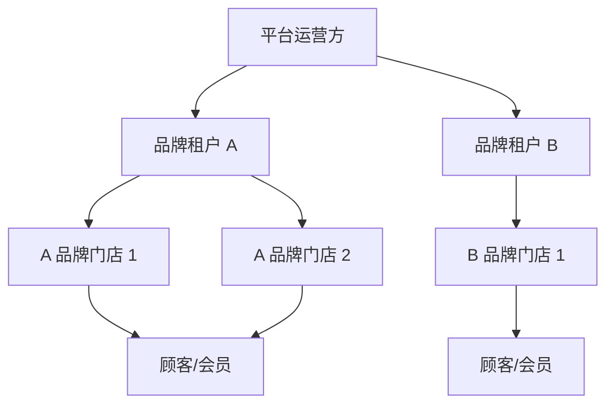
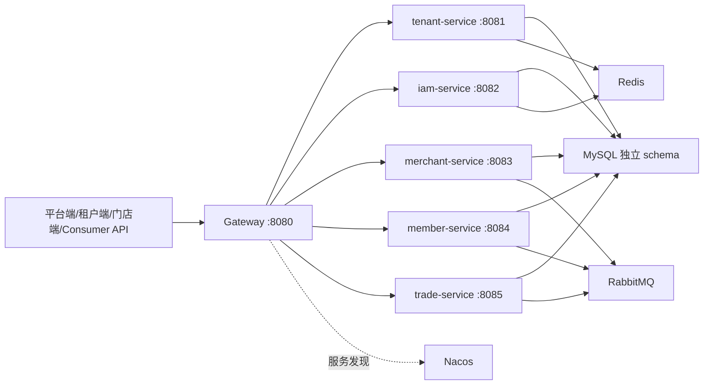
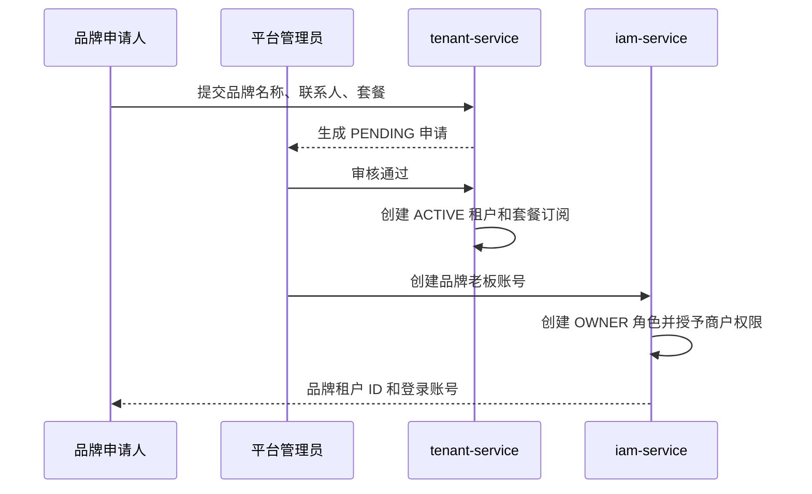

# SaaS 多租户商户智慧经营平台开发文档

文档版本：`2.7`  
更新日期：`2026-09-09`  
架构状态：`APPROVED`  
当前进度：`M0–M6 已完成；M7 消费者 H5 开发联调版已验收，生产上线门禁待完成`

> 本文档是项目唯一有效的开发基线，统一描述目标业务、实际完成情况、后续计划、开发流程和验收标准。代码中只有服务名称或预留路由，不代表对应业务已经完成。

2026-09-09 扩展：用户已确认 H5 统一平台首页、附近门店、店内分类、自提或消费者付邮费邮寄。新增门店展示/配送配置和邮寄订单履约；实现及验收边界见 [消费者 H5 当前扩展](CONSUMER-H5.md)。本扩展覆盖原 MVP 对单品牌入口、仅自提、不含快递的限制，物流轨迹与真实支付不在该轮实现范围内。

2026-09-10 扩展：按用户要求实现统一消费者账号、商家会员安全关联及邻里百货账号/订单聚合；设计、迁移和验证边界见 [统一消费者账号](UNIFIED-CONSUMER.md)。此扩展替代此前的各商家独立登录限制，资产仍按租户和会员隔离。

## 1. 项目定位

本项目是一套服务连锁品牌的企业级 SaaS 商户智慧经营平台。一套系统同时承载多个品牌租户，平台、品牌总部、门店员工和顾客通过不同入口使用系统。

核心价值：

- 多个品牌共享一套软件和微服务集群，但数据、权限、缓存和消息严格隔离。
- 品牌总部统一管理门店、商品、价格、库存、会员和营销活动。
- 门店完成订单处理、核销和库存管理，系统自动生成门店日结。
- 顾客选择具体门店下单，到店自提，会员权益在品牌内部跨店通用。
- 平台运营方只管理租户入驻、套餐、风险和平台经营指标，不参与商户日常经营。
- 通过销售和营销数据形成经营分析，辅助总部和门店决策。

首版定位为“可部署、可演示、可验证安全边界的 SaaS MVP”，不接入真实支付资质，不建设正式微信小程序，不包含物流配送、供应商、采购和加盟结算。

## 2. 四层业务模型



### 2.1 平台运营方

职责：

- 接收品牌入驻申请并审核。
- 创建、停用、恢复品牌租户。
- 配置标准版、高级版等套餐及功能额度；标准版最多同时拥有 2 个门店，高级版门店额度为 50。
- 管理平台公告、版本、风险和违规租户。
- 查看跨租户聚合后的平台经营数据。
- 管理 SaaS 订阅账单和续费，首版先实现套餐订阅，收费结算后续扩展。

限制：

- 平台身份不能直接调用商户经营接口。
- 平台默认不能读取订单明细、会员信息等商户内部数据。
- 合规排障需要临时跨租户访问时，必须审批、限时并完整审计。

### 2.2 品牌总部（租户）

职责：

- 管理品牌下的门店、组织、员工和角色。
- 统一维护商品、SKU、基础价格和上下架策略。
- 管理品牌级会员、等级、积分、储值和优惠券。
- 查看全部授权门店的库存、销售、日结和经营分析。
- 创建门店间调拨单并跟踪出库、运输、入库状态。

### 2.3 门店操作员

职责：

- 在被授权门店范围内处理商品、库存和订单。
- 完成收银、支付确认、到店自提核销、取消和退款申请。
- 执行库存盘点、调整、调拨出入库。
- 查看系统生成的门店日结及异常提示。

限制：

- 默认只允许访问当前门店数据。
- 不能通过修改 URL、请求体或请求头访问其他门店。
- 高风险操作需要店长或总部权限。

### 2.4 顾客（C 端）

职责与规则：

- 从平台首页选择入驻门店，可定位或按地区、店名搜索。
- 只查看所选门店可售商品和库存状态。
- 下单可选择门店支持的自提或快递邮寄；邮寄运费由消费者随订单支付，不支持跨门店合并结算。
- 会员、积分和储值属于品牌租户，可在同品牌门店使用。
- 订单、收入、退款和核销业绩归属所选门店。

原 M0–M6 通过 Consumer API 和最小测试页面验证。2026-09-07 用户批准新增独立消费者 H5（M7），先使移动端成熟，再开展小程序；本轮不开发小程序。详细范围、接口缺口、阶段验收和上线门禁见 [消费者 H5 开发流程](CONSUMER-H5.md)。

## 3. 系统架构

### 3.1 技术栈

| 层级 | 技术 |
|---|---|
| 后端 | JDK 21、Spring Boot 3.5、Spring Cloud 2025.0、Spring Cloud Alibaba 2025.0 |
| 网关与注册 | Spring Cloud Gateway、Nacos 3.0 |
| 数据访问 | MySQL 8.4、MyBatis-Plus、Flyway |
| 缓存与会话 | Redis 7.4 |
| 异步消息 | RabbitMQ 4、Transactional Outbox、消费幂等 |
| 安全 | Spring Security、JWT、BCrypt、RBAC、数据范围 |
| 前端 | Vue 3、TypeScript、Vite、Element Plus、ECharts、pnpm workspace |
| 测试部署 | JUnit 5、H2、后续 Testcontainers/Playwright、Docker Compose |

### 3.2 服务拓扑



### 3.3 服务职责

| 服务 | 数据所有权 | 主要能力 | 当前状态 |
|---|---|---|---|
| Gateway | 无业务数据 | 统一路由、JWT 校验、伪造内部头清理、可信上下文签名 | M1 已实现 |
| tenant-service | tenant schema | 入驻申请、审核、租户生命周期、套餐、订阅、权益 | M1 已实现 |
| iam-service | iam schema | 用户、登录、令牌、角色、权限、数据范围、审计 | M1 已实现 |
| merchant-service | merchant schema | 门店、商品、SKU、库存、调拨、员工业务档案、分析事件与经营指标 | M2 已完成并通过真实 API E2E |
| member-service | member schema | 会员、等级、积分、储值、优惠券、权益流水 | M4 已完成 |
| trade-service | trade schema | 自提订单、模拟支付、核销、门店业绩、财务流水 | M3 已完成 |

服务之间禁止直接访问对方数据库，只能调用版本化接口或订阅领域事件。

## 4. 多租户与权限安全模型

### 4.1 身份边界

登录规则：平台端、租户端、门店端均仅填写账号和密码；登录请求只包含 username、password。服务端根据账号唯一有效的成员关系确定租户及权限，不接受客户端租户编号作为登录选择条件。账号无有效归属或存在多个有效归属时拒绝登录，由管理员修正账号归属。

JWT 必须包含：

- `user_id`：当前用户。
- `tenant_id`：当前租户；平台身份固定为 `0`。
- `tenant_version`：租户状态版本，用于停用后即时废止旧令牌。
- `platform`：是否为平台身份。
- `permissions`：权限代码集合。
- `data_scope`：数据范围。
- `token_type`：访问令牌或刷新令牌类型。

Gateway 删除客户端伪造的 `X-Tenant-Id`、`X-User-Id`、`X-Internal-Caller` 和 `X-Internal-Signature`，只允许从校验后的 JWT 生成可信上下文。业务服务再次校验 JWT，不信任请求参数中的租户 ID。

### 4.2 数据范围

| 范围 | 含义 |
|---|---|
| `PLATFORM_ALL` | 平台管理域，不等于商户数据访问权 |
| `TENANT_ALL` | 品牌总部可访问本租户全部门店 |
| `STORE_SET` | 访问显式授权的门店集合 |
| `STORE_SELF` | 访问当前任职门店 |
| `OWNER_SELF` | 只访问本人创建或负责的数据 |

### 4.3 最终隔离规则

业务数据查询必须同时满足：

```text
tenant_id = 当前可信租户
AND store_id IN 当前授权门店集合
AND RBAC 拥有操作权限
AND 当前套餐拥有功能权益
```

隔离必须由服务端 SQL 拦截器、仓储查询和数据库约束共同保证，不能只依赖前端隐藏按钮。

当前真实状态：JWT 租户上下文、RBAC、MyBatis-Plus 自动租户 SQL 拦截、平台身份旁路拒绝、Redis 租户状态版本和套餐权益统一拦截机制均已实现并通过测试。M2 已建立真实门店、员工档案和任职授权表；`TENANT_ALL/STORE_SET/STORE_SELF` 已通过可信用户与真实任职关系计算可访问门店，并通过门店 A/B 和跨租户测试。

### 4.4 缓存与消息隔离

租户运行态 Key：

```text
saas:tenant:status:{tenantId}
saas:tenant:entitlements:{tenantId}
```

后续业务缓存统一使用 `saas:{environment}:{service}:{tenantId}:{business}:{key}`，禁止缺少租户维度。

领域事件必须携带：

```text
eventId, eventType, eventVersion, tenantId, aggregateId,
occurredAt, traceId, payload
```

消费者必须以 `eventId + consumerName` 去重。任何消费者都不能根据消息体中的 tenantId 绕过自己的租户校验。

## 5. 完整业务流程

本章描述项目最终必须实现的端到端流程。标记“已实现”的步骤已有代码和测试，其余属于对应里程碑。

### 5.1 品牌入驻与开通



当前状态：上述基础流程已实现。收费账单、续费、到期降级和自动停服未实现。

### 5.1.1 租户自助升级套餐（2026-09-06）

商户端顶部和门店额度耗尽提示提供“升级套餐”。非平台身份且具有 `TENANT_ALL` 数据范围、`merchant:store:manage` 权限的管理员可查看当前套餐和可升级选项，确认后立即更新本租户订阅与运行态权益，无需联系平台管理员。服务端拒绝不可用套餐和降级，仅允许保留现有已启用权益且至少有一项提升的套餐。当前没有收费、支付或自动续费流程。

### 5.2 登录与授权

1. 用户提交租户 ID、账号和密码。
2. IAM 校验 BCrypt 密码、账号状态和租户成员关系。
3. IAM 查询用户角色和权限，签发短期访问令牌及随机刷新令牌。
4. 数据库只存储刷新令牌 SHA-256 哈希。
5. 刷新时旧令牌立即撤销并轮换新令牌，旧令牌不能重复使用。
6. Gateway 校验签名、签发者和有效期，再路由到业务服务。
7. 业务服务通过可信上下文执行 RBAC 和数据范围判断。
8. 登录成功或失败均写入审计记录。

当前状态：1–8 已完成。访问令牌包含租户状态版本，Gateway 对照 Redis 运行态校验；租户停用后旧令牌即时返回 403，IAM 同时拒绝停用租户登录和刷新。

### 5.3 品牌组织与门店

1. 品牌总部创建门店，设置编码、名称、地址、营业时间和状态。
2. 创建员工业务档案并关联 IAM 用户。
3. 配置员工任职门店、岗位、角色和数据范围。
4. 店长只能管理授权门店，收银员只能执行收银和核销。
5. 门店停用后不能产生新订单，但历史数据保留可查。

当前状态：已实现门店、员工业务档案、主门店、任职门店集合和真实门店范围校验；门店创建、编辑、停用以及员工档案和授权门店管理已提供 API 与商户端页面。

门店账号补充（2026-09-06）：总部可配置独立登录账号、重置密码及配置权限。默认建议用户名采用 `store-{门店ID}-admin`，避免门店编码在不同租户重复导致撞名；现有账号不会自动改名，可通过“修改账号”主动更改。IAM 保留错误分派的原始状态，商户组织接口将下游账号重名显示为 409、参数错误为 400、其他下游 HTTP 异常为 502，避免原有错误覆盖成 401 后再表现为 500 的链路。

### 5.4 商品、价格和可售范围

1. 总部创建分类、SPU 和 SKU。
2. 总部设置品牌基础价、规格、条码和图片。
3. 商品发布后，选择适用门店；门店可在授权范围内设置可售状态。
4. 若允许门店价，则建立门店价格覆盖记录并记录审批人。
5. C 端选择门店后，只返回该店已上架且可售的 SKU。
6. 下单时保存商品名称、规格、单价和优惠规则快照，后续改价不影响历史订单。

当前状态：已实现分类、SPU、SKU、品牌基础价、门店价格覆盖和门店可售范围；只有已发布 SPU/SKU 可设为可售，门店价格覆盖受 SKU 配置和真实门店权限约束。

### 5.5 库存与跨店调拨

库存按 `tenant_id + store_id + sku_id` 管理，区分可用、预占和实际数量。

销售库存流程：

```text
创建订单 → 条件更新预占库存 → 支付成功扣减实际库存
取消/超时 → 释放预占 → 退款按规则决定是否回补
```

调拨流程：

```text
总部/门店发起调拨
→ 调出店审批
→ 调出店出库并扣减库存
→ 在途
→ 调入店验收入库
→ 生成双方不可变库存流水
```

每一步必须幂等并校验租户、门店权限和调拨状态，禁止产生负库存。

当前状态：已实现实际/可用/预占库存、不可变库存流水、调整、盘点、预占、释放、核销扣减和条件更新防负库存；已实现调拨草稿、审批、出库在途、验收入库、取消状态机以及双方库存流水。M3 已完成订单同步预占、支付实扣和超时释放的业务衔接。

### 5.6 顾客选店、自提下单与核销

1. 顾客进入某品牌入口并选择门店。
2. Consumer API 返回该门店可售商品。
3. 顾客选择会员身份、优惠券、积分或储值权益。
4. 交易服务请求营销服务试算，生成订单金额快照。
5. 创建订单并预占所选门店库存。
6. 模拟支付成功后确认权益核销并扣减库存。
7. 系统生成自提码；只有订单所属门店可以核销。
8. 核销成功后订单计入该门店业绩。
9. 超时未支付订单通过延时任务关闭并释放库存及权益。

当前状态：M3 订单与核销链路及 M4 会员身份、营销权益联动均已完成。

### 5.7 会员、积分、储值和优惠券

- 会员归属品牌租户，不归属单一门店。
- 同品牌任意门店可识别会员和使用允许跨店的权益。
- 积分、储值、优惠券必须使用账户/权益流水记录每次变动。
- 优惠券执行创建、发布、领取、冻结、核销、退回、过期状态机。
- 并发核销使用数据库条件更新、唯一业务键和幂等号，Redis 只用于加速。
- 退款根据原订单快照退回权益，不重新套用当前营销规则。

当前状态：已完成品牌级会员、积分/储值账户与不可变流水、优惠券模板/领取/冻结/确认/释放/退款/过期扫描；订单权益快照和跨店权益使用已接入。

### 5.8 退款、售后和财务流水

1. 门店或总部在权限范围内发起退款。
2. 系统检查订单状态和可退金额。
3. 使用业务幂等号创建退款单。
4. 模拟支付渠道返回成功后更新退款状态。
5. 写入负向财务流水并按规则退回积分、优惠券、储值和库存。
6. 订单、退款、权益和财务之间通过本地事务、Outbox 和补偿任务保证最终一致。

当前状态：M4 已完成订单退款、库存恢复、权益回退及负向财务流水；M5 已为交易和会员分析事件接入 Outbox 自动重试。独立售后工单和通用补偿任务属于后续增强。

### 5.9 门店自动日结和对账

1. 系统按门店和自然日自动归集订单、退款和支付。
2. 日终任务生成门店日结，汇总订单数、支付金额、退款金额和净收入。
3. 重复执行日结任务必须保持幂等，迟到交易进入重算或差异记录。
4. 总部查看所有门店日结和异常记录。

不建设收银员班次、备用金、手工交班和店长交班确认流程。

当前状态：未实现，属于后续财务增强；本项目明确不建设班次、备用金和交班确认。

### 5.10 经营分析

- 实时/分钟级营收趋势。
- 门店销售对比和净收入排行。
- 热销商品、SKU 和品类排行。
- 时段订单分析，以支付订单数作为客流代理口径。
- 新增会员、复购、积分和储值变化。
- 优惠券领取率、核销率和活动归因收入。
- 日终从交易事实表重新校准聚合数据。

当前状态：已实现分析事件 Inbox 幂等、订单/退款及会员事件事实表、分钟/日聚合、日终从事实表重算校准、营收/净收入/客单价/商品排行/门店排行/会员与券指标 API，以及连接真实 API 的经营大屏。订单、退款、会员和营销领域事件的生产端 Outbox 投递与真实环境 E2E 已完成。

### 5.11 租户停用

1. 平台执行停用并记录原因和审计。
2. tenant-service 更新租户状态和状态版本。
3. Redis 发布最新租户状态版本，Gateway 拒绝旧版本令牌。
4. 禁止登录、刷新和新增业务写入。
5. 保留历史数据，平台恢复租户后重新允许访问。

当前状态：步骤 1–5 已完成并通过真实 MySQL、Redis、Nacos、Gateway 端到端验收。

## 6. 当前仓库实际完成情况

### 6.1 M0 已完成

- Maven 后端多模块工程和六个业务服务骨架。
- Gateway 基础路由和 Nacos 可选服务发现。
- pnpm workspace，平台端、商户端、经营大屏和共享包。
- MySQL、Redis、RabbitMQ、Nacos Docker Compose。
- Actuator 健康检查、环境变量模板和基础测试。
- 后端全模块编译测试、前端类型检查、单测和生产构建。

### 6.2 M1 已完成的核心代码

- MyBatis-Plus、Flyway、MySQL Driver、Redis、Security、JWT 依赖。
- tenant/iam 初始迁移、领域模型、Mapper 和初始化数据。
- 商户申请、平台审核、租户开通、停用、恢复。
- 标准版/高级版套餐、套餐功能和租户订阅。
- BCrypt 密码、登录、JWT、刷新令牌哈希存储、轮换、登出。
- 平台权限和商户权限分域的 RBAC。
- `TENANT_ALL/STORE_SET/STORE_SELF/OWNER_SELF` 数据范围模型。
- 登录审计和租户操作审计。
- Gateway 清理伪造内部头并生成可信上下文。
- MyBatis-Plus `TenantLineInterceptor` 自动为租户业务 SQL 注入 `tenant_id`，仅允许显式平台表白名单。
- 平台身份禁止绕过租户业务 SQL 拦截器。
- Redis 发布租户状态版本、套餐功能及数量配额，Gateway、IAM 与业务服务采用失败关闭策略校验。
- 套餐权益注解和统一 AOP 拦截器，可与 RBAC 权限叠加使用。
- 六个服务接入统一 JWT 安全模块。
- 平台端登录、申请审核、租户停用/恢复和老板账号开通页面。
- 商户端登录、员工、角色和权限分配页面。
- 租户生命周期、套餐权益、RBAC、登录和刷新令牌集成测试。

### 6.3 M1 门禁验收结果

- SQL 改写测试验证主表和关联表均自动附加可信 `tenant_id`，显式白名单表不附加条件。
- 平台身份尝试进入租户 SQL 被拒绝，不能将平台管理权等同于商户数据访问权。
- Gateway 测试验证伪造租户/用户/内部调用头会被可信 JWT 身份覆盖。
- 平台令牌与商户令牌混用均返回 403。
- 套餐缺少功能代码时，即使请求已通过认证也会被统一拦截器拒绝。
- 租户停用或令牌版本过期时 Gateway 返回 403，恢复后必须重新登录。
- 已在真实 MySQL 8.4、Redis 7.4、Nacos 3.0 和 Gateway 环境完成入驻到停用/恢复的端到端验收。
- `scripts/m1-e2e.ps1` 提供可重复执行的 M1 API 验收。

门店 A/B 数据范围矩阵已基于 M2 的真实门店和业务表通过验收，不使用虚假占位功能。

### 6.4 阶段外增强项

M2–M6 的代码、迁移、页面、集成测试、真实基础设施 E2E、安全、性能和故障恢复门禁均已完成。收费账单、自动续费、独立售后工单和门店财务日结明确不属于 M0–M6 范围；其余服务骨架或规划入口不代表对应业务已开发。

### 6.5 2026-09-06 增量交付与验证

- 已增加租户自助升级入口、当前套餐和可升级套餐查询、提交校验及审计；接口详见 [API 文档](API.md)。
- 已修复门店账号下游 HTTP 错误映射，并调整两个账号配置入口的默认用户名。
- 已修复 Windows 运行中 JAR 阻止重新打包：默认启动流程先停止本项目服务并等待退出，完整构建后重启；进程发现按项目完整 JAR 路径匹配，启动记录包含复用服务。
- 已通过 11 项定向回归：`TenantServiceApplicationTests` 2 项、`StoreAccountHttpTests` 4 项、`StoreAccessIntegrationTests` 4 项、`StoreQuotaTests` 1 项。覆盖升级、降级拒绝、门店身份拒绝、内部账号创建、错误密钥、参数错误、账号冲突及既有门店范围/额度规则。
- 商户前端类型检查和生产构建通过；后端全模块 `package -DskipTests` 成功，7 个本地服务重启后健康检查均为 `UP`。
- 本地只读探测：内部账号查询 200，空账号参数 400，匿名访问套餐接口 401。本次未重新执行全套 M6、浏览器 E2E 或压测，也未对用户实际租户执行升级或重置密码。

### 6.6 门店账号编辑与密码检视

2026-09-06 补充：已增加既有账号登录名、显示名称与可选密码编辑；密码留空保留原值。门店列表按需检视密码，默认隐藏，30 秒、窗口失焦或组件卸载时清除明文，不写入浏览器持久存储。

IAM 新增 `V202609061900__store_credentials.sql`，保存 AES-GCM 密文与独立操作审计；登录继续使用 BCrypt。旧哈希不可还原，旧账号需重新设置一次密码。查看接口校验总部权限、本租户门店归属及 IAM 成员关系，并返回禁止缓存响应。密钥配置和恢复约束见运维手册。

验证结果：账号与密文集成测试 2 项、IAM HTTP 测试 5 项、门店范围测试 4 项均通过（共 11 项）。商户前端类型检查及生产构建通过，全后端打包通过；本地 MySQL 新迁移成功，7 个后端服务健康状态均为 UP。本次未执行浏览器 E2E，未修改用户已有账号密码。

## 7. 开发计划

状态定义：

- `已完成`：代码、迁移、页面、测试和文档全部通过。
- `进行中`：已有核心代码，但未通过全部门禁。
- `未开始`：只有计划或工程骨架。

| 阶段 | 目标 | 状态 | 预计工期 |
|---|---|---|---:|
| M0 | 工程底座、微服务和前端骨架、Compose | 已完成 | 3–5 天 |
| M1 | 租户、认证授权、套餐、可信上下文 | 已完成 | 8–12 天 |
| M2 | 门店、员工档案、商品、SKU、库存、调拨 | 已完成 | 10–14 天 |
| M3 | 自提订单、模拟支付、库存联动、核销、门店业绩与财务流水 | 已完成 | 12–16 天 |
| M4 | 会员、等级、积分、储值、优惠券 | 已完成 | 10–14 天 |
| M5 | 经营分析、事件聚合、对账校准 | 已完成 | 8–12 天 |
| M6 | E2E、安全、压测、部署与发布交付 | 已完成 | 6–10 天 |

### 7.1 M1 已完成清单

1. 已实现统一 MyBatis-Plus TenantLineInterceptor，覆盖租户业务服务。
2. 已建立显式忽略表白名单，平台身份默认禁止进入租户业务 SQL。
3. 已实现 Redis 租户状态版本和 Gateway/IAM 双重检查。
4. 已实现套餐权益注解和统一授权切面。
5. 已增加 SQL 隔离、伪造请求头、身份混用、状态版本和权益拦截测试。
6. 已完成平台入驻、审批、老板账号创建、商户登录、停用和恢复的真实容器 API E2E，并沉淀自动化脚本。

验收结论：M1 门禁通过。租户 SQL 不能绕过可信上下文；停用租户旧令牌立即失败；无套餐权益时即使通过认证也不能访问受限功能。

### 7.2 M2 门店、商品与库存

当前已完成：组织与真实门店权限；商品、价格和门店可售；库存余额、不可变流水、盘点和并发条件扣减；跨店调拨状态机与双边流水；租户端门店创建与经营汇总入口；独立门店作业入口；门店 A/B、跨租户、价格、幂等和并发测试；真实 MySQL、Redis、Nacos 和 Gateway API E2E。

验收结论：M2 门禁通过。`scripts/m2-e2e.ps1` 可重复验证商品发布、门店定价与可售、库存流水幂等、并发防负库存、盘点、调拨全状态流转、重复出库拒绝、双边库存流水和 `STORE_SELF` 跨店拒绝。

数据库：

- `store`、`employee_profile`、`employee_store`。
- `category`、`product_spu`、`product_sku`、`store_product`、`store_price`。
- `inventory`、`inventory_ledger`、`stock_transfer`、`stock_transfer_item`。

后端：

1. 门店创建、编辑、停用和营业状态。
2. 员工档案、任职门店和授权门店集合。
3. 分类、SPU、SKU、品牌价格、门店价格和门店可售范围。
4. 库存调整、盘点、预占、释放和扣减接口。
5. 跨店调拨状态机和双边库存流水。
6. 租户/门店复合索引、乐观锁、库存非负条件更新。

前端：

- 门店和员工任职管理。
- 分类、商品/SKU、价格和上下架。
- 门店库存、库存流水、盘点和调拨。

验收门禁：总部可见本品牌所有门店；门店员工只能访问授权门店；并发调整不产生负库存；调拨重复提交不重复扣减。

### 7.3 M3 订单、自提核销与财务

当前进度：已完成。项目负责人批准的 M3 范围为完整自提订单链路；退款不计入 M3 门禁但已于 M4 交付，分析事件 MQ Outbox 已于 M5 交付；售后工单和自动日结属于阶段外增强。

数据库：

- `orders`、`order_item`、`payment`、`pickup_verification`、`finance_ledger`。

后端：

1. 顾客按租户选择营业门店及该门店真实可售商品。
2. 交易服务重新获取可信门店报价，保存名称、规格、图片、售价和数量快照。
3. 创建订单并同步预占订单所属门店库存，订单请求和库存操作均幂等。
4. 模拟支付成功，支付请求重放不重复入账，预占库存正式扣减。
5. 生成自提码，只有实际任职于订单所属门店的员工可以核销。
6. 核销完成后写入门店业绩和不可变财务流水。
7. 定时扫描未支付超时订单，条件更新关闭并释放全部预占库存。

验收门禁：同一创建请求只生成一个订单；同一支付请求重放只入账和扣库一次；订单只能由所属门店员工核销；支付/超时关闭竞争结果合法；超时订单释放全部预占库存。集成测试和 `scripts/m3-e2e.ps1` 真实环境验收均已通过。

### 7.4 M4 会员与营销

当前进度：已完成。会员服务提供品牌级会员、积分/储值审计调整、优惠券模板与领取及权益冻结、确认、释放、退款回退；订单保存权益快照，并在创建、支付、超时关闭和退款时对接会员服务，同时回补库存和写入负向财务流水。优惠券提供过期扫描；商户端提供会员创建、积分/储值调整和优惠券发布。已通过 H2 集成测试、M1–M3 回归，以及真实 MySQL/Redis/Nacos/Gateway 的 `scripts/m4-e2e.ps1` 验收。

数据库：

- `member`、`member_level`。
- `points_account`、`points_ledger`。
- `stored_value_account`、`stored_value_ledger`。
- `coupon_template`、`member_coupon`、`benefit_ledger`。

后端：

1. 品牌级会员注册、等级和画像。
2. 积分获取、抵扣、退回和过期。
3. 储值充值、消费、退款和人工调整审计。
4. 优惠券创建、领取、冻结、核销、退回和过期。
5. 下单试算、权益冻结、支付确认、取消/退款回滚。
6. 条件更新、唯一键和幂等号防超发、防重复核销。

验收门禁：会员可在同品牌门店使用权益；不同品牌会员完全隔离；最后一张券并发领取最多一个成功；退款后权益流水完整回退。

### 7.5 M5 经营分析

1. 定义订单、退款、会员、积分和营销事件版本。
2. 事件 Inbox 去重并生成分钟/日聚合。
3. 实现营收、净收入、订单数、客单价、商品排行和门店对比。
4. 实现会员增长、复购和活动转化指标。
5. 日终从事实表校准聚合，处理迟到和缺失事件。
6. 完成商户经营大屏和平台聚合大盘。

验收门禁：聚合指标能解释且有明确口径；日终值与交易事实一致；门店与租户范围严格隔离。

### 7.6 M6 最终交付

当前进度：已完成。Playwright、Testcontainers、安全、完整业务链路 k6、RabbitMQ/MySQL/Analytics-Outbox 故障恢复均已实际执行通过；部署、运维、API、演示和发布验收文档已交付。

1. Playwright 完成平台开通到经营大屏的全链路 E2E。
2. Testcontainers 验证 MySQL、Redis、RabbitMQ 集成。
3. k6/JMeter 压测登录、商品、下单、领券、核销和大屏。
4. 执行跨租户、权限提升、伪造请求头和敏感日志安全测试。
5. 演练 MQ 停止、重复消息、数据库异常和 Outbox 补偿。
6. 完成部署手册、操作手册、演示数据、API 文档和发布验收材料。

最终演示链路：

```text
平台审核品牌
→ 开通套餐和老板账号
→ 总部创建门店、员工、商品和库存
→ 总部发起跨店调拨
→ 顾客选店、领券和自提下单
→ 门店支付核销并自动扣库存
→ 退款和权益回退
→ 系统自动聚合经营事实并执行日终校准
→ 总部查看跨店经营分析
→ 跨租户攻击被服务端拒绝
```

### 7.7 2026-09-06 维护迭代

本次补充账号再次修改和密码按需检视，包含历史账号提示、加密副本、查看审计及权限测试。

租户自助升级、门店账号错误处理、Windows 后端构建启停修复及配套文档已交付。收费结算、自动续费仍为后续扩展；本次验证范围见第 6.5 节。

## 8. 标准开发流程

每个功能严格遵循以下顺序：


### 8.1 开发前

- 明确平台、总部、门店、顾客中谁能执行操作。
- 明确数据属于哪个服务、租户和门店。
- 明确状态机、幂等键、审计字段和失败补偿。
- 明确套餐权益和 RBAC 权限代码。
- 先写正常、越权、重复请求和并发验收场景。

### 8.2 数据库

- 迁移只允许通过 Flyway，已应用迁移禁止修改。
- 业务表必须包含主键、`tenant_id`、必要的 `store_id`、创建/更新时间。
- 可变聚合根使用 `version` 乐观锁。
- 业务幂等号建立唯一约束。
- 金额使用整数分或 `DECIMAL`，禁止浮点。
- 库存、积分、储值和财务必须有不可变流水。
- 查询索引以 `tenant_id` 开头，门店表通常使用 `tenant_id, store_id` 前缀。

### 8.3 后端

- Controller 只处理协议、校验和身份入口。
- Application Service 编排用例和事务。
- Domain 保存状态机和核心规则。
- Infrastructure 实现 Mapper、缓存、消息和外部适配器。
- 不接受前端提交的 tenantId 作为商户数据归属依据。
- 写接口必须考虑幂等、并发、审计和事务边界。
- 跨服务事务默认使用本地事务 + Outbox + 幂等消费，不默认引入分布式事务框架。

### 8.4 前端

- 平台端、商户端和大屏保持独立应用。
- API 统一通过共享客户端访问 Gateway。
- 页面按钮权限只是体验优化，服务端必须重复鉴权。
- 401 尝试一次刷新令牌；刷新失败清理会话。
- 大列表必须分页；金额、时间和状态统一格式化。
- 页面完成必须同时覆盖加载、空数据、错误和无权限状态。

### 8.5 测试

每个业务至少包含：

- 正常流程。
- 状态不合法。
- 租户 A 访问租户 B。
- 门店 A 访问门店 B。
- 缺少 RBAC 权限。
- 缺少套餐权益。
- 重复请求或重复消息。
- 关键资源并发竞争。
- 审计记录验证。

### 8.6 文档与状态更新

- 只有代码、迁移、页面和测试均完成才修改里程碑状态。
- 工程骨架、空 Controller、预留路由不能标记业务完成。
- 每次完成模块或修复后同步更新第 6、7、12 节；接口、操作或启动行为变化时同步更新 API、演示、部署、运维及 README 中的对应说明，并记录实际验证范围。
- 新增重大架构决策直接记录到本文档“架构决策记录”，不再创建零散文档。

## 9. API 和事件规范

### 9.1 API 路径

```text
/api/platform/v1/**   平台端
/api/merchant/v1/**   总部和门店端
/api/consumer/v1/**   顾客端
/internal/v1/**       微服务内部接口，不由公网直接暴露
```

写接口优先使用请求幂等键。分页统一使用 `page`、`size`，排序字段使用白名单。所有错误返回稳定业务错误码，不向前端泄露 SQL、堆栈或密钥。

### 9.2 已实现 API 范围

- `/api/auth/v1/login|refresh|logout`
- `/api/platform/v1/tenant-applications/**`
- `/api/platform/v1/tenants/**`
- `/api/platform/v1/plans/**`
- `/api/merchant/v1/subscription`、`/api/merchant/v1/subscription/upgrades`、`/api/merchant/v1/subscription/upgrade`
- `/api/merchant/v1/me`
- `/api/merchant/v1/users/**`
- `/api/merchant/v1/roles/**`
- `/api/merchant/v1/permissions/**`

完整业务接口范围见 [API 概览](API.md)；仅存在 Gateway 路由不代表接口已经实现。

### 9.3 事件可靠性

- 业务数据与 Outbox 事件在同一数据库事务提交。
- 发布器异步投递，成功后标记事件已发布。
- 消费者先写 Inbox 去重记录，再执行业务事务。
- 重试必须有上限，超过上限进入 DLQ 并告警。
- 延时任务使用分级延时队列加数据库补偿扫描，不能只依赖 MQ 定时精度。

## 10. 本地开发与验证

环境要求：JDK 25+、Maven 3.9+、Node.js 22、pnpm 11.9+、Docker Desktop。

基础设施：

```powershell
Set-Location E:\project\SAAS
Copy-Item .env.example .env
docker compose --env-file .env -f deploy\compose\compose.yml up -d
docker compose --env-file .env -f deploy\compose\compose.yml ps
```

本机已有 MySQL 占用 3306，因此 Docker MySQL 默认映射到 `13306`。Nacos API 为 `8848`，本地控制台为 `18080`。

后端验证：

```powershell
Set-Location E:\project\SAAS\backend
mvn test
```

前端验证：

```powershell
Set-Location E:\project\SAAS\frontend
pnpm install
pnpm typecheck
pnpm test
pnpm build
```

核心服务启动顺序：tenant-service → iam-service → Gateway。详细环境变量和账号说明以根目录 README 为准。

三个核心服务启动并健康后，可重复执行 M1 验收：

```powershell
Set-Location E:\project\SAAS
.\scripts\m1-e2e.ps1
```

共享环境必须通过参数传入实际平台账号密码，禁止继续使用模板密码。

## 11. Definition of Done

一个功能只有同时满足以下条件才算完成：

- 业务规则和异常规则明确。
- Flyway 迁移在 H2 测试和 MySQL 容器均成功。
- 服务端租户、门店、RBAC 和套餐校验完整。
- 幂等、并发、事务和审计已处理。
- API 有稳定请求响应和错误码。
- 前端具备完整交互和错误状态。
- 单元、集成、越权和关键并发测试通过。
- 前端类型检查、单测和生产构建通过。
- 不含真实密钥、默认生产密码和敏感日志。
- 本文档中的实际状态已更新。

任何一项不满足，只能标记为“进行中”，不能标记“已完成”。

## 12. 当前下一步

门店账号可再次修改，保存后的密码可通过小眼睛检视；历史账号需要重新设置一次密码。后续维护需保留加密密钥与数据库的一致性。

2026-09-06 维护迭代已完成，涵盖租户自助升级、门店账号错误处理与后端启停修复，相关文档已同步。实际验证记录见第 6.5 节。后续功能与修复均须同步更新开发基线及受影响的使用文档。

M0–M6 已通过全部发布门禁。M6 已完成 Playwright 平台/经营大屏 E2E、MySQL/Redis/RabbitMQ Testcontainers、API 越权与跨租户安全、完整业务链路 k6、RabbitMQ/MySQL 故障恢复、Analytics-Outbox 自动补偿，以及部署/运维/API/演示/发布验收文档。后续工作转为常规版本迭代与非阻断性能优化。

1. 已完成：品牌级会员、积分与储值账户调整及不可变审计流水。
2. 已完成：优惠券模板、领取、并发条件更新、冻结、确认、释放、过期与退款回退。
3. 已完成：订单权益试算与快照、支付确认、超时释放、退款权益/库存回退和负向财务流水。
4. 已完成：商户端会员创建、积分/储值调整、优惠券发布及权限控制。
5. 已完成：H2 集成测试、M1–M3 回归与真实 MySQL/Redis/Nacos/Gateway M4 E2E。

## 13. 架构决策记录

| 日期 | 决策 | 状态 |
|---|---|---|
| 2026-08-04 | 采用六业务服务 + Gateway 的 SaaS 微服务架构 | 已批准 |
| 2026-08-04 | 使用 tenant_id 行级隔离，并叠加门店数据范围 | 已批准 |
| 2026-08-04 | 使用本地事务 + Outbox + 幂等消费保证跨服务最终一致 | 已批准 |
| 2026-08-04 | 首版使用模拟支付和最小 Consumer API，不建设正式小程序 | 已批准 |
| 2026-08-04 | 前端采用 pnpm 单仓多应用 | 已批准 |
| 2026-08-15 | 租户总部管理端与门店作业端拆分为独立入口 | 已完成 |
| 2026-08-04 | 文档收敛为 DEVELOPMENT.md 单一开发基线 | 已批准 |
| 2026-08-05 | M1 采用租户 SQL 自动注入、Redis 状态版本和权益注解作为统一安全门禁 | 已完成 |

## 14. 已知限制

- M0–M6 已完成并通过发布验收。
- 本地 Nacos Compose 为方便开发暂时关闭认证；共享和生产环境必须启用认证并创建专用服务账号。
- MySQL 8.4 会显示当前 Flyway 版本支持范围警告，迁移已在实际 MySQL 8.4 容器验证。
- 平台端和商户端当前打包体积较大，后续按路由拆包。
- 当前测试覆盖 H2、真实本地 API E2E、Playwright、MySQL/Redis/RabbitMQ Testcontainers，以及 k6 完整写链路性能门禁。


### 门店同租户调拨规则（2026-09-06）

门店账号可在本店范围发起调拨申请，供货店必须是同租户有效门店。共享查询仅提供商品和可用库存，禁止以此权限任意操作其它店库存。来源店确认出库，申请店确认入库。直寄客户关联原销售订单和收款，整单履约不增加申请店库存；收入、订单归属不随供货店变化。原订单已扣库存通过专用撤回流水纠正，不记为调拨入库。订单锁定期间禁止重复自提核销；取消后恢复自提。已出库禁止取消，售后走关联订单退款。

### 租户统一供货与库存预警（2026-09-07）

商品由租户总部维护，总部按门店和 SKU 分配入库数量，并查看各店实际、可用、预占库存及分配流水。分配直接增加目标门店库存，不引入额外总部仓库。门店商品目录仅展示已配置或已有库存的租户商品。门店手动调整仅用于负数损耗，盘盈需要总部确认；调拨收货、订单退款等业务库存变动保持原流程。

可用库存达到门店 SKU 预警线时，总部与对应门店同时显示提醒；补货或释放预占后自动解除。默认预警线为 5，总部可按店按 SKU 修改。页面可见时每 15 秒刷新，失败显示刷新错误，通知采用站内页面提醒。

验证：merchant-service 集成测试包含分配幂等、批量回滚、租户/门店隔离、预占预警、零库存、商品原子创建及盘盈审批。前端运行 `pnpm typecheck` 和 `pnpm exec playwright test --config playwright.inventory.config.ts`，验证两端提醒、分店分配、预警线和商品创建。


## M7：消费者移动 H5（2026-09-07 用户批准）

采用 Vue 3 + TypeScript + Vite，新增 `frontend/apps/consumer-web`（5177）。本轮扩展既有后端，建立消费者独立身份、品牌展示配置、选店选品、按店购物车、服务端试算、订单归属、下单/取消、受开关控制的模拟支付、自提码、会员优惠及流水、已完成订单的退款申请与门店审核。真实支付、短信验证、历史会员安全绑定、正式域名与生产运营准备列入上线门禁，不把模拟链路当作正式运营完成。

旧消费者会员、订单、领券接口不再匿名开放；顾客必须取得消费者 JWT。订单新增 `consumer_member_id`，历史无所属消费者身份的订单不会凭手机号自动认领。已更新 M3/M4 脚本使用消费者账号，模拟支付需显式开启。

2026-09-07 验收结果：全前端类型检查/构建通过；消费者边界单测 3 项、浏览器夹具用例 4 项通过；品牌配置 2 项、消费者账号 3 项、订单生命周期 12 项集成测试通过；M3/M4 真实跨服务脚本通过；真实 H5 注册→试算→下单→模拟支付→门店核销→消费者售后→审核退款的浏览器流程通过。真实试算发现并修复会员接口要求正数关联编号的契约问题。详见 VALIDATION.md 与 CONSUMER-H5.md。

